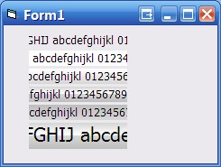

<div align="center">

## Frame buffered, all API, scrolling label control


</div>

### Description

Labels where all the text doesn't fit due to space constraints. Gah! Here is the solution! Flexbible font face and size, several styles.

All API driven from font creation to frame buffering.
 
### More Info
 
Label scrolls when mouse move in the final 10 pixels.

where the caption is too long, '...' displayed.

Click on the label to stop and disable the scrolling.

dbl click to re enable the scrolling

backstyle flat, light and dark gradient, vista split gradient style.

any font and size.


<span>             |<span>
---                |---
**Submitted On**   |2008-08-08 11:50:02
**By**             |[Michael Toye](https://github.com/Planet-Source-Code/PSCIndex/blob/master/ByAuthor/michael-toye.md)
**Level**          |Intermediate
**User Rating**    |4.7 (14 globes from 3 users)
**Compatibility**  |VB 6\.0
**Category**       |[Custom Controls/ Forms/  Menus](https://github.com/Planet-Source-Code/PSCIndex/blob/master/ByCategory/custom-controls-forms-menus__1-4.md)
**World**          |[Visual Basic](https://github.com/Planet-Source-Code/PSCIndex/blob/master/ByWorld/visual-basic.md)
**Archive File**   |[Frame\_buff212307882008\.zip](https://github.com/Planet-Source-Code/michael-toye-frame-buffered-all-api-scrolling-label-control__1-70935/archive/master.zip)

### API Declarations

```
SetPixel SetRect FillRect CreateFont TextOut SetTextColor StretchDIBits BitBlt CreateCompatibleBitmap CreateCompatibleDC SelectObject GetDC DeleteDC DeleteObject SetBkMode
MulDiv GetDeviceCaps CreateBrushIndirect OleTranslateColor
```


